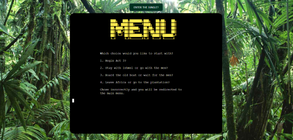

# Heart of Darkness
## Choose your own adventure Game

Link to the deployed site is [here](https://heart-of-darkness.herokuapp.com/). 

-----

## Table of Contents

- [Description](#description)
- [Theme](#theme)
- [Objective](#objective)
- [Features](#features)
- [Testing](#testing)
- [Technologies](#technologies)
- [Deployment](#cloning)
- [Credits](#credits)
- [Acknowledgements](#acknowledgements)
- [Author Info](#author-info)

------

## Description

For this project I took inspiration from one of my favourite books, [Heart of Darkness](https://en.wikipedia.org/wiki/Heart_of_Darkness) by Joseph Conrad.
This book was also the inspiration for Francis Ford Coppola's movie [Apocalypse Now](https://www.imdb.com/title/tt0078788/).   
I borrowed the broad outline of a European man arriving into the Congo Jungle at the height of the Belgian colonial conquest.
From this starting point I created an original character and wrote an original story with multiple forks in the road for the user to navigate as they try to make it to the end of the story alive. I included a couple of games into the narrative so depending on the choices the user makes they may come across a game to play.

## Objective
To deliver a command line game that is interactive, engaging and fun for the users.   

## Theme
The theme for this project was largely constrained by the criteria that it had to be a command line interface application.
I still felt the need to incorporate a little design into the project.
So i chose a jungle scene to serve as the background image, centered the terminal inside the image, centered the 'Enter the Jungle?' button
above the terminal and colored the button a deep green.

During the story/game I also incorporated multiple examples of ascii art. From creating text art for the title page and act markers to images of a 
boat, a revolver, a fish among others to try and impart a sense of the jungle in the user.

[Back to the Top](#table-of-contents)

-----

## User Experience

### From a User's Perspective
As a user it is important: 

1. That it is easy to follow the story.  
3. That they understand how to start and play through the story/game. 
5. They can quit if they want to.  

### Users Fulfilment

1.  The site is laid out clearly so the user knows immediately what to do. 
2.  An introduction message is provided explaining the narrative. 
3.  Clear instructions are given on how to play the game.
4.  The user is asked if they would like to begin the story.
5.  Prompts are provided every time the user must make a decision. 
5.  The user is given the opportunity to quit the story/game in each of the three acts. 
7.  After each act ends the user is asked if they would like to continue.. 

-----
## UX 

I wanted to give the story/game a bit of styling to add to the overall user experience. I kept it minimal as the instructions were to produce a command line interface application. By adding a background image, a border around the terminal and color to the 'Enter the Jungle?' button I
believe that the finished styles work well with the theme of the story/game and the project.

[Back to the Top](#table-of-contents)

### Python Logic

I created a flow chart using draw.io. The chart gave me an idea of the flow of the game and how the game would progress, bu keeping this close to hand as i built the project it was possible to

-------
## Features

### Home Page

### Intro/How to play

### Act 1,2 & 3 headings

### Menu

### Colored text

### Games

### Multiple Game over screens, One after completing/quitting without dying and one after you die. 

[Back to the Top](#table-of-contents)

### Data Model

### Design  

Design was limited for this project as it was primiarily command line based.  I did however want to give it some element of design so positioned the terminal to the center of the screen to make it look like a tv screen.  I added a background image of a stadium which complimented the quiz.   

[Back to the Top](#table-of-contents)

-----
## Future Implementation 

[Back to the Top](#table-of-contents)

-----
## Technologies Used 

- [HTML5](https://en.wikipedia.org/wiki/HTML5)
- [CSS3](https://en.wikipedia.org/wiki/CSS)
- [Python](https://www.python.org/) 
- [a11y](https://color.a11y.com/Contrast/) 
- [GitPod](https://www.gitpod.io/)
- [GitHub](https://github.com/)
- [GitBash](https://www.atlassian.com/git/tutorials/git-bash#:~:text=What%20is%20Git%20Bash%3F,operating%20system%20through%20written%20commands.)
- [Heroku](https://id.heroku.com/login)
- [Draw.io](https://drawio-app.com/)
- [vsCode](https://code.visualstudio.com/)
- [Google Chrome Dev Tools](https://developer.chrome.com/docs/devtools/)
- [Markdown](https://markdown-guide.readthedocs.io/en/latest/)

-----
## Resources 

- [Code Institute](https://codeinstitute.net/ie/)
- [Slack](https://slack.com/intl/en-ie/) 
- [Stack OverFlow](https://stackoverflow.com)
- [YouTube](https://www.youtube.com/)
- [Udemy](https://www.udemy.com/)
- [FreeCodeCamp](https://www.freecodecamp.org/)
- [W3Schools.com](https://www.w3schools.com/)
- [MDN Web Docs](https://developer.mozilla.org/en-US/)

## Python Libraries/Modules

- [Colorama](https://pypi.org/project/colorama/)
- [Random](https://www.cs.swarthmore.edu/~adanner/cs21/f09/randomlib.php#:~:text=Using%20the%20random%20library&text=The%20random%20module%20provides%20access,the%20basic%20features%20of%20python.)
- [Time](https://docs.python.org/3/library/time.html)
- [os](https://www.geeksforgeeks.org/os-module-python-examples/#:~:text=The%20OS%20module%20in%20Python,*os*%20and%20*os.)
- [sys](https://www.geeksforgeeks.org/python-sys-module/)

[Back to the Top](#table-of-contents)

-----
## Testing

### User Testing

The website was sent to a group of approximately 15 people.  Users found the game easy to work through.  This testing for the most part produced spelling errors and complaints that some of the questions were too hard! 

### Manual Testing

I carried out manual testing to ensure that game flow was correct, everything was working as it should and validation caught any errors. 

- Tests carried out: 
  - Start-up Display - Verify that: 
    - The logo displays.
    - The welcome message displays with information on the game.
    - The user is prompted for their name.
    - The user can enter their name.
    - The user gets a warning message if the name is longer than 10 characters. 
    - The user gets a warning message if the name is just numbers. 
    - The user gets a warning message if the name is blank. 
  
  - Display Rules or Play - Verify that: 
    - The user is asked if they want to see the rules or play.
    - The user is prompted to type an "r" to see the rules and "p" to play. 
    - That warning message appears if anything other than a "p" or "r" is entered by the user. 
    - That the user is asked to enter "r" or "p" again.  
  
  - Rules - Verify that:
    - If the user types "r" the rules are displayed.
    - The message is clear to the user on how to play. 
    - The user is asked if they would like to Play or Quit. 
    - That the user is prompted to type in "p" to play or "q" to quit. 
    - That a warning message appears if anything other than a p or q is entered.  
  
  - Quit Early - Verify that: 
    - When the user types "q" to quit as above a message displays saying goodbye to the user and pointing out that if they wish to play they can click the Let's Play Button. 
    - By clicking the Let's Play Button the website is refreshed and the quiz re-starts. 
  
  - Quiz Choices - Verify that: 
    - If the user types p to play as above in the Rules Section that a list of choices appears to the user. 
    - That the list displayed contains the correct instructions to the user to proceed. 
    - That a warning will appear if the player chooses anything other than the six options above. 

[Back to the Top](#table-of-contents)

### Browser Testing

The Website has been tested on Google Chrome, Microsoft Edge, and Firefox. On all browsers testing was as expected.  

[Back to the Top](#table-of-contents)

### Validators 

The three python files were tested using [Pep8 Validation](http://pep8online.com/checkresult). 

No errors were found.

###  Result: Chrome Lighthouse 

I used Chrome Lighthouse to test Performance on the website. 

[Back to the Top](#table-of-contents)

### Color Contrast Testing 

I used [a11y](https://https://color.a11y.com/) to test the color contrast on the website which produced no issues. 

[Back to the Top](#table-of-contents)

### Issues/Bugs Fixed 

**Errors in GitPod**

As I worked in GitPod I used the problems menu constantly.  For the most part the errors were in relation to whitespaces, indentations and two line spacing before functions.  I fixed the errors as I went so when it came to validating my code with the PEP8 validator there were no errors and my code was clean.  

### Issues Unresolved

[Back to the Top](#table-of-contents)

-----
## Version Control

### Git and GitHub 

Local repository and IDE used: GitPod & VsCode for early trials of how to move forward.
Remote repository used: GitHub

Steps followed: 
- I created a new public repository on GitHub using the Code Institute template.
- I then created a workspace and started coding on GitPod. 
- All relevant files were created. 
- To save my work safely I continued to use the terminal consistently by using: 
    - **git add .** to add work to git
    - **git commit -m""** to commit the work 
    - **git push** to update work to GitHub 

### Deployment to Heroku

The website was deployed to heroku by doing the following: 

1. Navigate to [heroku](https://id.heroku.com/login). 

2. Click "new" and create a new App. 

3. Give your app a name, choose your region and Click "Create app". 

4. The menus that we are concerned with are "Deploy" and "Settings".  Click on "Settings" First. 

5. Copy the contents of the creds.json file.  Insert "CREDS" into the key field and the entire contents of the file into the value field.  The template code provided will use this information to create the file called creds.json and write this data into it as the application is built. 

6. Buildpacks now need to be added.  These install future dependancies that we need outside of the requirements file.   The first is python and the second is node.js.  Select Python first and then node.js and click save.  Make sure they are in this order.

7. Then go to the deploy section and choose your deployment method.  To connect with github select github and confirm. 

8. Search for your repo, select it and click connect. 

9. You can choose to either deploy using automatic deploys which means heroku will rebuild the app everytime you push your changes.  For this option choose the branch to deploy and click enable automatic deploys.  This can be changed at a later date to manual.  Manual deployment deploys the current state of a branch.  

10. Click deploy branch. 

11. If successful you should be able to view your deployed app by clicking "View". 
    

  ### Fork a Repository: 
        
    A copy can be made of a repository by forking the repository.  The copy can then be viewed and changed without affecting the original repository. 
    
      - From your list of repositories select the repository you want to fork.
      - On the top of the page to the right had side you will see a fork image.  Click on the button to create a copy. 

  ### Clone a Repository: 
        
    Cloning this project from GitHub can be done by following these steps: 
    
      - From your list of repositories select the repository you want to deploy.
      - Click on the code tabe. 
      - Click on the clipboard icon to copy the URL.  
      - Open Git Bash in your IDE. 
      - Change the current working directory to the location you want to place the clone. 
      - Type git clone and paste the copied URL.  
      - Press enter for the clone to be created. 

[Back to the Top](#table-of-contents)

## Credits 

Initially I looked at Portfolio 3 Projects on the Code Institute Slack Community to get some inspiration.  I found two quiz apps created by [Mike](https://github.com/MikeR94) and [Dave](https://github.com/DaveyJH).  Those two were massive quizzes to follow and honestly a bit overwhelming.  It was from Mike's readme that I saw the blog from [Brock Byrd](https://brockbyrdd.medium.com/).  Like Mike I followed this and primarily used the setup of Brock's questions and answers from this blog.  From this I slowly built my app using the resources mentioned above I made it my own.  I actually really enjoyed putting this together.  

[Back to the Top](#table-of-contents)

-----
## Acknowledegments

I would like to acknowledge the help and support given by my mentor Chris Quinn, all of the students in my own study group aswell as all the students in the wider Code Institute Slack channels. My cohort Facilitator [Kasia](https://github.com/bezebee) and all of the staff at Code Institute. The sense of comraderie among all of these individuals has helped me to feel at home on my journey to a new career in programming.

[Back to the Top](#table-of-contents)

## Author Info

- [GitHub](https://github.com/KSheridan86)
- [Linkedin](https://www.linkedin.com/in/kensheridan86/)

[Back to the Top](#table-of-contents)