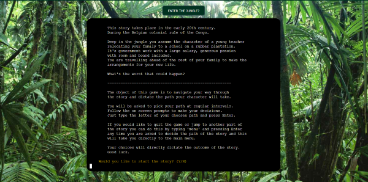
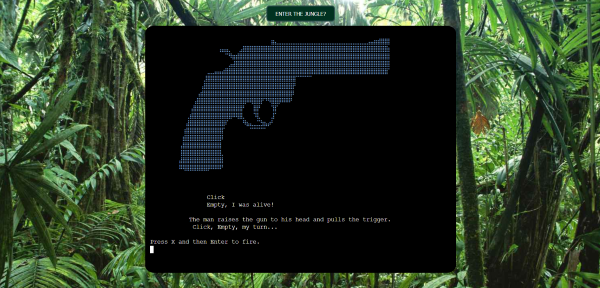

# Heart of Darkness

## Choose your own adventure Game
------------------------------------


Live site available [here](https://heart-of-darkness.herokuapp.com/). 


-----

## Table of Contents
--------------------------------------

- [Description](#description)
- [Theme](#theme)
- [Objective](#objective)
- [Features](#features)
- [Testing](#testing)
- [Technologies](#technologies)
- [Deployment](#cloning)
- [Credits](#credits)
- [Acknowledgements](#acknowledgements)
- [Author Info](#author-info)

------

## Description
---------------------------------------

For this project I took inspiration from one of my favourite books, [Heart of Darkness](https://en.wikipedia.org/wiki/Heart_of_Darkness) by Joseph Conrad.
This book was also the inspiration for Francis Ford Coppola's movie [Apocalypse Now](https://www.imdb.com/title/tt0078788/).   
I borrowed the broad outline of a European man arriving into the Congo Jungle at the height of the Belgian colonial conquest.
From this starting point I created an original character and wrote an original story with multiple forks in the road for the user to navigate as they try to make it to the end of the story alive. I included a couple of games into the narrative so depending on the choices the user makes they may come across a game to play.


## Objective
----------------------------
To deliver a command line game that is interactive, engaging and fun for the users.   


## Theme
-----------------------------
The theme for this project was largely constrained by the criteria that it had to be a command line interface application.
I still felt the need to incorporate a little design into the project.
So I chose a jungle scene to serve as the background image, moved the terminal inside the image, gave the terminal a border with rounded edges, rounded the 'Enter the Jungle?' button and colored it a deep green.

During the story/game I also incorporated multiple examples of ascii art. From creating text art for the title page and act markers to images of a boat, a revolver, a fish among others to try and impart a sense of the jungle in the user.

### Colors
----------------
In keeping with a minimal design i only used two colors, these are: 

1. #013220
2. #2f4f4f

Two deep shades of green to tie in with the jungle imagery.

[Back to the Top](#table-of-contents)


-----

## User Experience
---------------------------------


### From a User's Perspective
------------------------------------
As a user it is important: 

1. That it is easy to follow the story.  
3. That they understand how to start and play through the story/game. 
5. They can quit if they want to.  


### Users Fulfilment
--------------------------------------

1.  The site is laid out clearly so the user knows immediately what to do. 
2.  An introduction message is provided explaining the narrative. 
3.  Clear instructions are given on how to play the game.
4.  The user is asked if they would like to begin the story.
5.  Prompts are provided every time the user must make a decision. 
6.  The user is given the opportunity to quit the story/game with each choice they make. 

-----
## UX 
------

I wanted to give the story/game a bit of styling to add to the overall user experience. I kept it minimal as the instructions were to produce a command line interface application. By adding a background image, a border around the terminal and color to the 'Enter the Jungle?' button I believe that the finished styles work well with the theme of the story/game and the project.


[Back to the Top](#table-of-contents)


### Python Logic
--------------

I created a flow chart using draw.io. The chart gave me an idea of the flow of the game and how the game would progress, by keeping this close to hand as I built the project it was possible to control the flow of the story without losing sight of the goal.


-------
## Features
------------

### Home Page

  Title and intro quote.
  Here the user gets prompted to enter thier name to continue.


---------------------
### Intro/How to play

  This page holds a synopsis of what the game is about
  aswell as instructions on how to play and quit.



------------------------------
### Act 1,2 & 3 headings

  Example of the ascii art used in the headings


----------------
### Menu

  Main menu is accesible from nearly anywhere in the game.
  Use this to quit the game or move around the story as you wish.


-----------------
### Colored text

  Colored text was achieved using colorama, a python library.


-------------------
### Games

  Two games are available for the user to play,
  neither are mandatory but both are possible in one 
  pass through the story.

  The games are a basic fishing game and russian roulette a game of chance.




------------------
### Game Over 

  Multiple game over screens, One after completing/quitting without dying and one after you die. 


[Back to the Top](#table-of-contents)


-----
## Future Implementation 
--------------------------
  Given the time I would like to rework the story and make it much bigger.
  Extra narrative, more games, possibly a black jack game.
  I would very much like to have the background image change as the user progresses through
  the story, from jungle scene to boat to saloon to plantation among others.
  This is beyond my abilities at the moment and not needed for this project.

[Back to the Top](#table-of-contents)


-----
## Technologies Used 
---------------------

- [HTML5](https://en.wikipedia.org/wiki/HTML5)
- [CSS3](https://en.wikipedia.org/wiki/CSS)
- [Python](https://www.python.org/) 
- [a11y](https://color.a11y.com/Contrast/) 
- [GitPod](https://www.gitpod.io/)
- [GitHub](https://github.com/)
- [GitBash](https://www.atlassian.com/git/tutorials/git-bash#:~:text=What%20is%20Git%20Bash%3F,operating%20system%20through%20written%20commands.)
- [Heroku](https://id.heroku.com/login)
- [Draw.io](https://drawio-app.com/)
- [vsCode](https://code.visualstudio.com/)
- [Google Chrome Dev Tools](https://developer.chrome.com/docs/devtools/)
- [Markdown](https://markdown-guide.readthedocs.io/en/latest/)


-----
## Resources 
----------------

- [Code Institute](https://codeinstitute.net/ie/)
- [Slack](https://slack.com/intl/en-ie/) 
- [Stack OverFlow](https://stackoverflow.com)
- [YouTube](https://www.youtube.com/)
- [Udemy](https://www.udemy.com/)
- [FreeCodeCamp](https://www.freecodecamp.org/)
- [W3Schools.com](https://www.w3schools.com/)
- [MDN Web Docs](https://developer.mozilla.org/en-US/)


## Python Libraries/Modules
---------------------------

- [Colorama](https://pypi.org/project/colorama/)
- [Random](https://www.cs.swarthmore.edu/~adanner/cs21/f09/randomlib.php#:~:text=Using%20the%20random%20library&text=The%20random%20module%20provides%20access,the%20basic%20features%20of%20python.)
- [Time](https://docs.python.org/3/library/time.html)
- [os](https://www.geeksforgeeks.org/os-module-python-examples/#:~:text=The%20OS%20module%20in%20Python,*os*%20and%20*os.)
- [sys](https://www.geeksforgeeks.org/python-sys-module/)


[Back to the Top](#table-of-contents)


-----
## Testing
-------------

### User Testing
-----------------

The website was sent to a group of approximately 10 people. They found the game easy to work through and enjoyable.
For the most part this only discovered spelling and grammar errors.

Also the project was posted into the 'peer-code-review' channel on slack and no bugs or issues were reported.


### Manual Testing
--------------------

I carried out manual testing to ensure that game flow was correct, everything was working as it should and validation caught any errors. 

- Tests carried out: 
  - Home screen - Verify that: 
    - The Title displays.
    - The intro quote is printed.
    - The user is prompted for their name.
    - The user can enter their name.
    - The user gets a warning message if the name is longer than 50 characters. 
    - The user gets a warning message if the name is blank. 

  - How to screen - Verify that: 
    - The introduction narrative prints.
    - The how to play instructions are printed. 
    - That the user is asked to enter "y" or "n" to begin.  

  - Regular narrative and choices - Verify that:
    - The story begins and offers the user the choice to choose their path.
    - That the story progresses as the user wishes. 
    - That a warning message appears if anything other than the available choices is entered.  

  - Menu - Verify that: 
    - The menu is available from any of the forks in the path.
    - That the menu works properly, all inputs are correctly validated, warning messages appear and are clear. 

  - Games - Verify that: 
    - If the user chooses to play a game, the correct game is loaded. 
    - That the game plays as intended without any errors. 
    - That any variables altered during the game are accessible later for the corrct purposes.

  - Ascii Art - Verify that:
    - All ascii art is displayed as intended and the color is correct.


[Back to the Top](#table-of-contents)


### Browser Testing
-----------------------

The Website has been tested on Google Chrome, Microsoft Edge, and Firefox. On all browsers testing was as expected.  


### Validators 
----------------------

The three python files were tested using [Pep8 Validation](http://pep8online.com/checkresult). 

No errors were found.

###  Result: Chrome Lighthouse
---------------------------------- 

I used Chrome Lighthouse to test Performance on the website. 


### Color Contrast Testing 
-----------------------------

I used [a11y](https://https://color.a11y.com/) to test the color contrast on the website which produced no issues. 


### Issues/Bugs Fixed 
-----------------------------

  Any issues or bugs that were encountered were mainly due to indentation errors spelling mistakes and import mistakes.
  These were fixed in production as they were found so when it came to validating my code with the PEP8 validator
  there were no errors and my code was clean.  


[Back to the Top](#table-of-contents)


-----
## Version Control
----------------------

### Git and GitHub 
----------------------

Local repository and IDE used: GitPod & VsCode for early trials of how to move forward.
Remote repository used: GitHub

Steps followed: 
- I created a new public repository on GitHub using the Code Institute template.
- I then created a workspace and started coding on GitPod. 
- All relevant files were created. 
- To save my work safely I continued to use the terminal consistently by using: 
    - **git add .** to add work to git
    - **git commit -m""** to commit the work 
    - **git push** to update work to GitHub 

---------------------------
### Deployment to Heroku
---------------------------

The website was deployed to heroku by doing the following: 

1. Navigate to [heroku](https://id.heroku.com/login). 

2. Click "new" and create a new App. 

3. Give your app a name, choose your region and Click "Create app". 

4. The menus that we are concerned with are "Deploy" and "Settings". Click on "Settings" First. 

5. Buildpacks now need to be added. These install future dependancies that we need outside of the requirements file. The first is python and the second is node.js. Select Python first and then node.js and click save. Make sure they are in this order.

6. Then go to the deploy section and choose your deployment method. To connect with github select github and confirm. 

7. Search for your repo, select it and click connect. 

8. You can choose to either deploy using automatic deploys which means heroku will rebuild the app everytime you push your changes. For this option choose the branch to deploy and click enable automatic deploys. This can be changed at a later date to manual. Manual deployment deploys the current state of a branch.  

9. Click deploy branch. 

10. If successful you should be able to view your deployed app by clicking "View". 
    
------------------------
  ### Fork a Repository: 
--------------------------

  A copy can be made of a repository by forking the repository.  The copy can then be viewed and changed without affecting the original repository. 
  
  - From your list of repositories select the repository you want to fork.
  - On the top of the page to the right had side you will see a fork image.  Click on the button to create a copy. 


-------------------------
  ### Clone a Repository:
  ----------------------- 

  Cloning this project from GitHub can be done by following these steps: 

  - From your list of repositories select the repository you want to deploy.
  - Click on the code tab. 
  - Click on the clipboard icon to copy the URL.  
  - Open Git Bash in your IDE. 
  - Change the current working directory to the location you want to place the clone. 
  - Type git clone and paste the copied URL.  
  - Press enter for the clone to be created. 


[Back to the Top](#table-of-contents)


## Credits 
--------------------

I have to credit Joseph Conrad, his book 'Heart of Darkness' gave me the idea and location for this story.

I have only used one image for the background. this was sourced here: https://www.ambardcusa.org/congo_jungle_ctt/

I sourced ascii_art from three places.
- 1: http://www.patorjk.com/software/taag/#p=display&f=Graffiti&t=Type%20Something%20

  This site allowed me to input text and have it generated as ascii art.

- 2: https://emojicombos.com

  Library of emoji art.

- 3: https://asciiart.website/index.php

  Library of ascii art

The quote on the home page is by Friedrich Nietzsche.

A quick google search for how to clear the terminal gave me this command:
```
    os.system('cls' if os.name == 'nt' else 'clear')
``` 
I incorporated this into the clear_terminal() function, it is used extensively to control the flow of text in the terminal.

While researching for how to print the text character by character I found this code on stackoverflow:

```
    for character in x:
        sys.stdout.write(character)
        sys.stdout.flush()
        time.sleep()
```
I included this in the txt_effect() function.

All of the rest of the code base and the story is my work.


[Back to the Top](#table-of-contents)


-----
## Acknowledegments
---------------------------

I would like to acknowledge the help and support given by my mentor Chris Quinn, he is never short of good ideas. 
All of the students in my own study group aswell as all the students in the wider Code Institute Slack channels. My cohort Facilitator [Kasia](https://github.com/bezebee) and all of the staff at Code Institute. The sense of comraderie among all of these individuals has helped me to feel at home on my journey to a new career in programming.


[Back to the Top](#table-of-contents)

## Author Info
--------------------

- [GitHub](https://github.com/KSheridan86)
- [Linkedin](https://www.linkedin.com/in/kensheridan86/)


[Back to the Top](#table-of-contents)